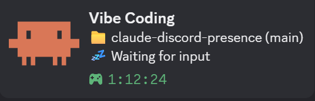

# claude-discord-presence

[](https://github.com/gabrielhom/claude-discord-presence/actions/workflows/test.yml) [](https://www.npmjs.com/package/claude-discord-presence)

Discord Rich Presence for the [Claude Code](https://claude.com/claude-code) CLI. Shows what you're working on, live.



- **Zero dependencies** — talks Discord IPC directly.
- **Works on WSL2** — Discord runs on Windows behind a named pipe that Linux processes can't see; this detects WSL and runs the tiny daemon with Windows `node.exe` instead. Also works natively on Linux (incl. Flatpak/Snap Discord), macOS and Windows.
- **Multi-session aware** — one daemon for all your Claude sessions; the card shows the one you touched last plus `· +N sessions`, elapsed time since the first one started.
- **Live status** from Claude Code hooks: prompting (`💬`), file being edited (`✏️`), command running (`⚙️`), search (`🔍`), subagents (`🤖`), idle (`💤`).
- **Privacy-safe by default** — never shows your prompt text, shell commands, search patterns or full URLs. See [Privacy](#privacy).
- Zero config: ships with a default Discord application ("Vibe Coding" — Discord rejects "Claude" in app names, so bring your own app if you want a different title).

## Install

**As a Claude Code plugin** (recommended — no settings.json edits, auto-updates):

```
/plugin marketplace add gabrielhom/claude-discord-presence
/plugin install claude-discord-presence@claude-discord-presence
```

**Or via npm:**

```bash
npm install -g claude-discord-presence
claude-discord-presence setup       # writes hooks to ~/.claude/settings.json
claude-discord-presence status      # daemon + active sessions
claude-discord-presence uninstall   # removes hooks, stops daemon
```

Pick one, not both. Open a new `claude` session — it's on your profile. Requires Node ≥ 18 and the Discord **desktop** app (on WSL: Node installed on the Windows side too, e.g. `winget install OpenJS.NodeJS`).

## Config (optional)

`~/.claude/claude-discord-presence.json`:

```json
{
  "clientId": "your-discord-application-id",
  "showPrompt": true,
  "showProject": false,
  "largeImage": "my-art-asset-key"
}
```

- `clientId` — use your own app from the [Developer Portal](https://discord.com/developers/applications) to control the name/icon. Env `CLAUDE_PRESENCE_CLIENT_ID` also works.
- `showPrompt` — set `true` to show the first 110 chars of your prompt instead of `💬 Prompting` (default `false`).
- `showProject` — set `false` to show `📁 a project` instead of the repo name and branch (default `true`).
- `largeImage` — key of an image uploaded under your app's *Rich Presence → Art Assets*. Default: none (Discord shows the app icon).

## Privacy

Everything on the card is visible to anyone who can see your Discord profile, so by default only this leaves your machine:

| Event | Shown | Not shown |
|---|---|---|
| Session start | repo folder name + branch (`showProject: false` hides both) | path |
| Prompt | `💬 Prompting` (`showPrompt: true` shows the first 110 chars) | prompt text |
| Edit / Read | file **basename** (`server.ts`) | directory |
| Bash / subagent | Claude's short description of the step ("Run tests") | the actual command |
| WebFetch | hostname only | full URL, query string |
| Grep / Glob | `🔍` | pattern |

State files live in your temp dir and are deleted when the session ends.

## How it works

Hooks (`SessionStart`, `UserPromptSubmit`, `PreToolUse`, `Stop`, `SessionEnd`) each write a small JSON state file per session in the temp dir. `SessionStart` spawns a single detached daemon (if none is running) that watches the directory, composes one activity from all sessions and pushes `SET_ACTIVITY` to Discord. `SessionEnd` deletes the session's file; the daemon exits once none remain. On WSL the directory is reached via `\\wsl.localhost\...` by the Windows-side daemon. Stale files (8h without update — e.g. Claude was killed hard) are dropped automatically.

## License

MIT
